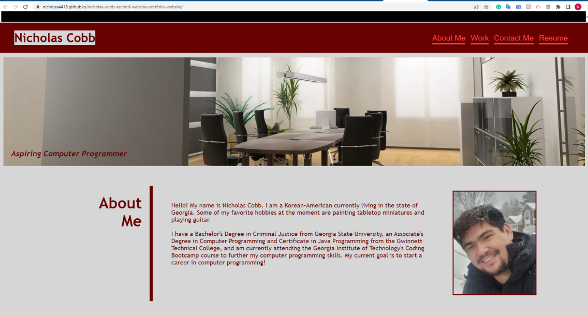

# Second Website

## Description

- The motivation behind this project was to create a portfolio website from scratch.
- I worked on this project as a means to practice advanced CSS coding, as well as provide myself with a website portfolio to show to future employers
- The problem this project solves is that I did not have any sort of means to demonstrate coding projects I had created.
- I learned about the importance of using CSS to stylize a website, specifically the use of classes, IDs, and flexboxes.

## Installation 
- N/A

## Usage
- This project can be used as a quick guide or refresher on advanced CSS coding techniques, such as the usage of flexboxes, responsive layout design, and pseudo-classes.
- It can also be used as a legitimate portfolio to demonstrate my coding projects.

## Screenshot

## Credits
- N/A

## License
- MIT License / Refer to the License in the project's repo.

## Link
- https://nicholas4418.github.io/nicholas-cobb-second-website-portfolio-website/